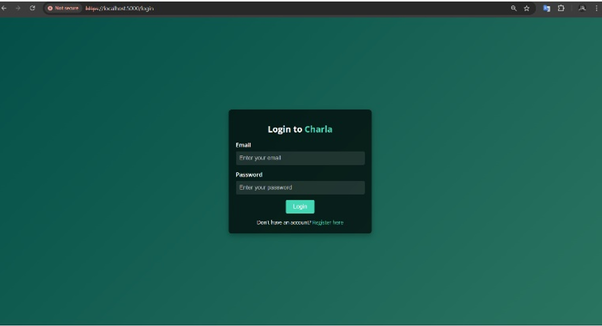
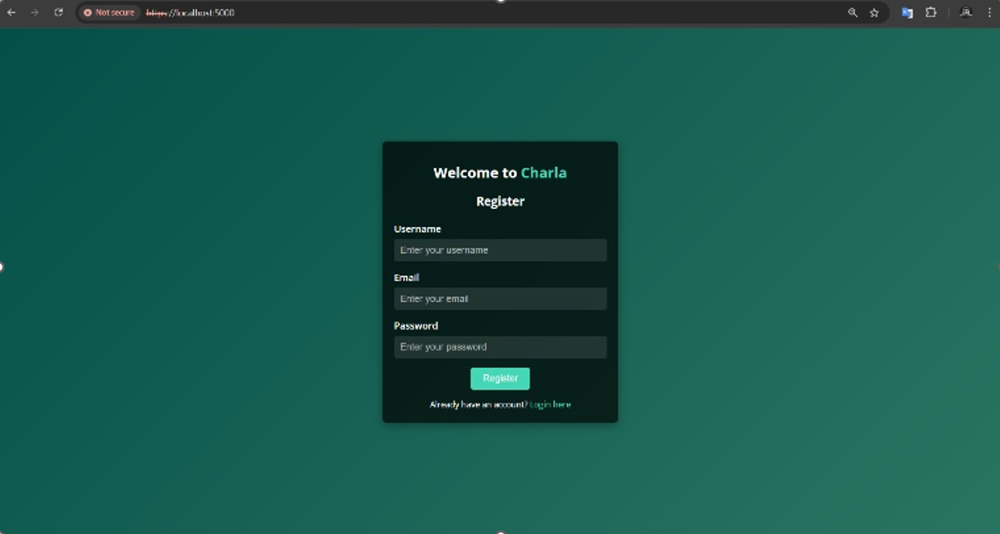
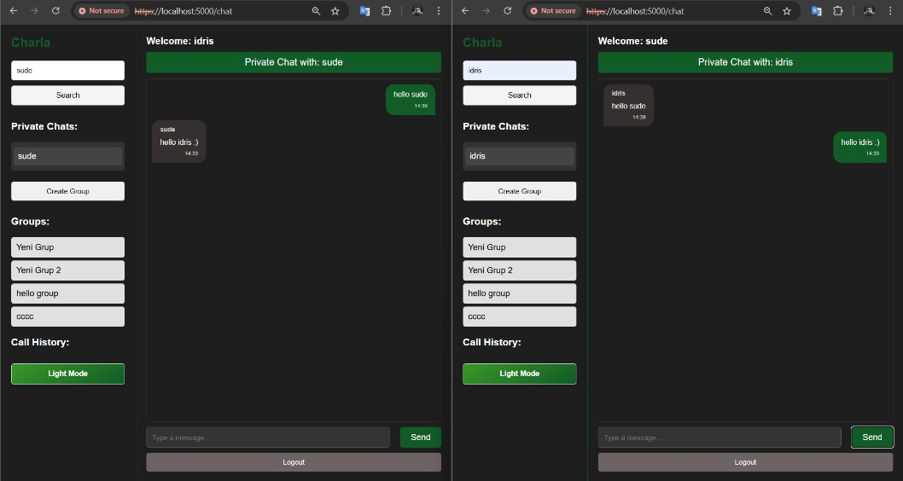
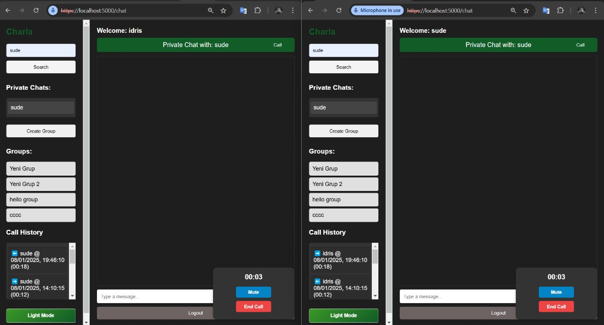
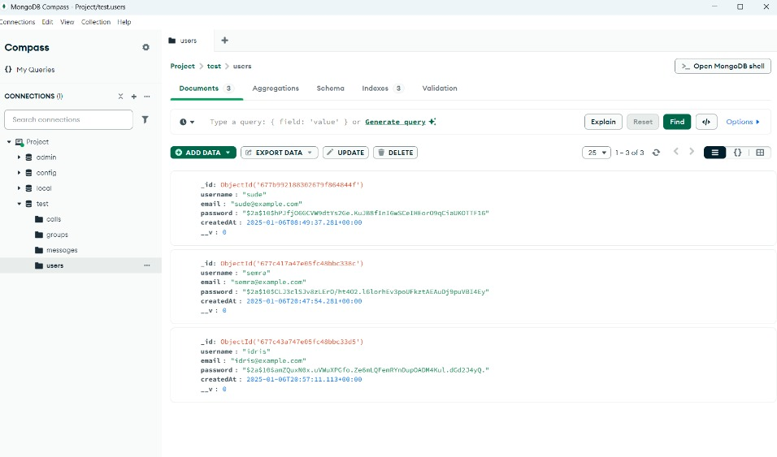
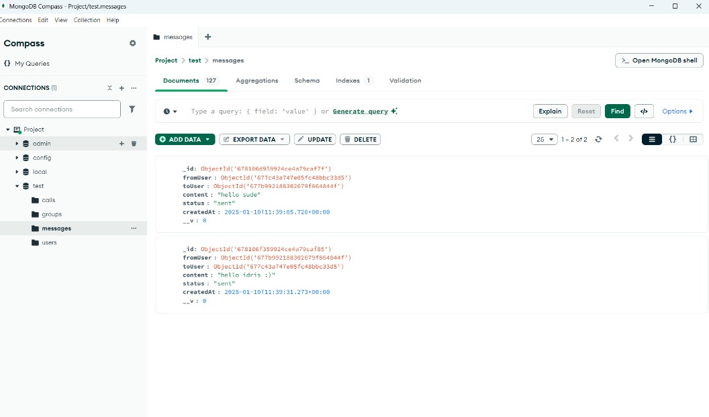
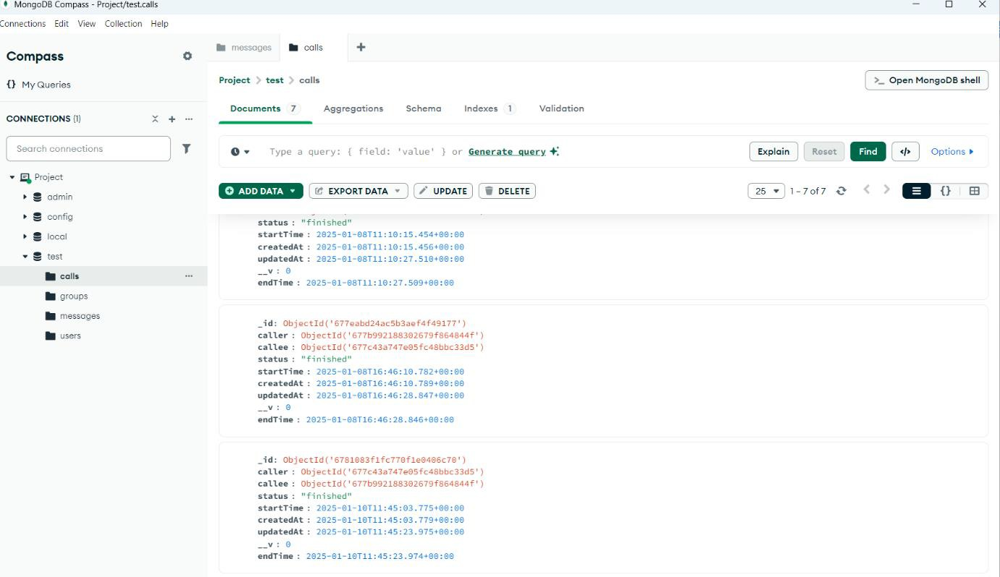

# charla-realtime-communication
A real-time chat and voice call application built with Node.js, Express, MongoDB, WebRTC, and Socket.IO. Includes user authentication, message storage, call history, and live communication features.


# 🔧 Technical Architecture & Implementation Details

This project is a **full-stack real-time communication platform** built using modern web technologies. It supports **user authentication**, **private messaging**, **voice calling**, and **real-time updates** through WebSockets.

---

## 🧱 1. System Architecture Overview

The platform follows a **client–server architecture**:

### **Client (Frontend)**
- HTML, CSS, JavaScript  
- Communicates with backend via **REST API** (authentication, data fetching)  
- Uses **Socket.IO WebSockets** for real-time chat  
- Uses **WebRTC** for peer-to-peer audio communication  

### **Server (Backend – Node.js / Express.js)**
- Handles user registration & login  
- Stores messages and call logs  
- Manages all WebSocket events  
- Acts as the *signaling server* for WebRTC (exchange of offer/answer + ICE candidates)

### **Database (MongoDB)**
- Stores user accounts  
- Stores chat messages  
- Stores call logs  
- Uses ObjectId references to link relationships  

---

## 🧩 2. Technologies Used

| Feature | Technology |
|--------|------------|
| Backend Server | **Node.js + Express.js** |
| Real-Time Messaging | **Socket.IO** |
| Voice Calls (P2P Audio) | **WebRTC** |
| Database | **MongoDB** |
| Password Security | **bcrypt (hashing)** |
| SSL Certificates | **Self-signed (for WebRTC secure context)** |
| API Testing | **Postman** |
| Frontend | HTML, CSS, JavaScript |

---

## 📡 3. Real-Time Messaging (Socket.IO)

When a user sends a message:

1. Client emits `sendMessage`  
2. Server receives → saves in MongoDB  
3. Server emits `newMessage` to receiver in real-time  

This enables instant delivery and UI updates without refresh.

Each message document looks like:

```json
{
  "fromUser": "ObjectId",
  "toUser": "ObjectId",
  "content": "Hello!",
  "status": "sent",
  "createdAt": "timestamp"
}
```


## Screenshots

### 1. Sign In Page


### 2. Register Page


### 3. Private Chat Screen


### 4. Calling Feature


### 5. Users Collection (Database)


### 6. Chats Collection (Database)


### 7. Calls Collection (Database)

